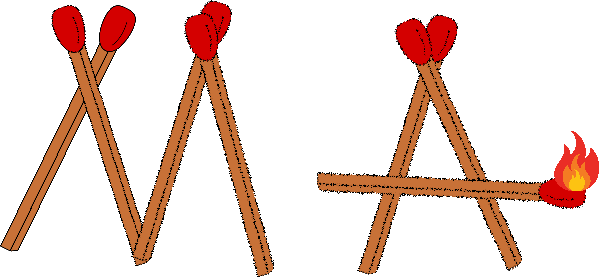

<!-- Improved compatibility of back to top link: See: https://github.com/othneildrew/Best-README-Template/pull/73 -->
<a name="readme-top"></a>
<!--
*** Thanks for checking out the Best-README-Template. If you have a suggestion
*** that would make this better, please fork the repo and create a pull request
*** or simply open an issue with the tag "enhancement".
*** Don't forget to give the project a star!
*** Thanks again! Now go create something AMAZING! :D
-->


<!-- PROJECT SHIELDS -->
<!--
*** I'm using markdown "reference style" links for readability.
*** Reference links are enclosed in brackets [ ] instead of parentheses ( ).
*** See the bottom of this document for the declaration of the reference variables
*** for contributors-url, forks-url, etc. This is an optional, concise syntax you may use.
*** https://www.markdownguide.org/basic-syntax/#reference-style-links
-->
[![Contributors][contributors-shield]][contributors-url]
[![Forks][forks-shield]][forks-url]
[![Stargazers][stars-shield]][stars-url]
[![Issues][issues-shield]][issues-url]


<!-- PROJECT LOGO -->
<br />
<div align="center">
  <a href="https://github.com/KingOfTNT10/Matchstick_Algorithm-Python">
    
  </a>

<h3 align="center">Matchstick Algorithm</h3>

  <p align="center">
    This project can solve matchstick puzzels and creates ones
    <br />
    <a href="https://github.com/KingOfTNT10/Matchstick_Algorithm-Python"><strong>Explore the docs »</strong></a>
    <br />
    <br />
    <a href="https://github.com/KingOfTNT10/Matchstick_Algorithm-Python">View Demo</a>
    ·
    <a href="https://github.com/KingOfTNT10/Matchstick_Algorithm-Python/issues">Report Bug</a>
    ·
    <a href="https://github.com/KingOfTNT10/Matchstick_Algorithm-Python/issues">Request Feature</a>
  </p>
</div>

[Website](https://kingoftnt10.github.io)

<!-- TABLE OF CONTENTS -->
<details>
  <summary>Table of Contents</summary>
  <ol>
    <li>
      <a href="#about-the-project">About The Project</a>
      <ul>
        <li><a href="#built-with">Built With</a></li>
      </ul>
    </li>
    <li>
      <ul>
        <li><a href="#installation">Installation</a></li>
      </ul>
    </li>
    <li><a href="#usage">Usage</a></li>
    <li><a href="#info">Info</a></li>
    <li><a href="#contributing">Contributing</a></li>
    <li><a href="#contact">Contact</a></li>
  </ol>
</details>


<!-- ABOUT THE PROJECT -->
## About The Project

This project solves any mathematical matchstick puzzels, This algorithm takes a string, for example: `6+4=4`, and will look for solutions. For this equation it will find 2:
1. `0+4=4`
2. `8-4=4`

For each one it will explain exactly how to solve.
example for the first one:
`moved the middle of 6 to it's top right to make a 0`

example for the second one:
`added a matchstick to "-" (to make a "+") from the top right of "8" (to make a "6")`

<p align="right">(<a href="#readme-top">back to top</a>)</p>


### Built With

[![Python][Python]][Python-url]

<p align="right">(<a href="#readme-top">back to top</a>)</p>


### Installation

1. Clone the repo
   ```sh
   git clone https://github.com/KingOfTNT10/Matchstick_Algorithm-Python.git
   ```
2. Install libraries:
   ```sh
   pip install py_expression

<p align="right">(<a href="#readme-top">back to top</a>)</p>


<!-- USAGE EXAMPLES -->
## Usage
To solve an equation you need to import the algorithm file and call the solve function:

```py
import algorithm

solve_data = algorithm.solve("6+4=4")
print(solve_data)
```

To create an equation with answers:
```py
import algorithm

# create_equation has one argument called answer, this argument decides what the answer for the random math problem should be
# example: algorithm.create_equation(answer=4)
# It would return for example:
# {'equation': '2+5=4', 'solutions': [{'new_equation': '2+2=4', 'original_equation': '2+5=4', 'explanation': "moved the top left of 5 to it's top right to make a 2"}]}

equation_data = algorithm.create_equation()
print(equation_data)
```

See the [open issues](https://github.com/KingOfTNT10/Matchstick_Algorithm-Python/issues) for a full list of proposed features (and known issues).

<p align="right">(<a href="#readme-top">back to top</a>)</p>


<!-- INFO -->
## Info
This program is using a custom format to represent numbers, for example the number 5:\


This number is represented like this in the code (other examples can be found in [stickData](https://github.com/KingOfTNT10/Matchstick_Algorithm-Python/blob/main/stickData.json)):
```python
[
  [1, 1, 0],
  [0, 1, 1, 1]
]
``` 

Because we divide the number into 2 cells/rows:


And we number the sticks from left to right (counter-clock wise) (`green`=`1`, `red`=`0`):


So the first cell comes out as:
```python
[1, 1, 0]
```
And the second:
```python
[0, 1, 1, 1]
```

<!-- CONTRIBUTING -->
## Contributing

Contributions are what make the open source community such an amazing place to learn, inspire, and create. Any contributions you make are **greatly appreciated**.

If you have a suggestion that would make this better, please fork the repo and create a pull request. You can also simply open an issue with the tag "enhancement".
Don't forget to give the project a star! Thanks again!

1. Fork the Project
2. Create your Feature Branch (`git checkout -b feature/AmazingFeature`)
3. Commit your Changes (`git commit -m 'Add some AmazingFeature'`)
4. Push to the Branch (`git push origin feature/AmazingFeature`)
5. Open a Pull Request

<p align="right">(<a href="#readme-top">back to top</a>)</p>


<!-- CONTACT -->
## Contact

Your Name - Ilai K - ilai.keinan@gmail.com

Project Link: [https://github.com/KingOfTNT10/Matchstick_Algorithm-Python](https://github.com/KingOfTNT10/Matchstick_Algorithm-Python)

<p align="right">(<a href="#readme-top">back to top</a>)</p>

<!-- MARKDOWN LINKS & IMAGES -->
<!-- https://www.markdownguide.org/basic-syntax/#reference-style-links -->
[contributors-shield]: https://img.shields.io/github/contributors/KingOfTNT10/Matchstick_Algorithm-Python.svg?style=for-the-badge
[contributors-url]: https://github.com/KingOfTNT10/Matchstick_Algorithm-Python/graphs/contributors
[forks-shield]: https://img.shields.io/github/forks/KingOfTNT10/Matchstick_Algorithm-Python.svg?style=for-the-badge
[forks-url]: https://github.com/KingOfTNT10/Matchstick_Algorithm-Python/network/members
[stars-shield]: https://img.shields.io/github/stars/KingOfTNT10/Matchstick_Algorithm-Python.svg?style=for-the-badge
[stars-url]: https://github.com/KingOfTNT10/Matchstick_Algorithm-Python/stargazers
[issues-shield]: https://img.shields.io/github/issues/KingOfTNT10/Matchstick_Algorithm-Python.svg?style=for-the-badge
[issues-url]: https://github.com/KingOfTNT10/Matchstick_Algorithm-Python/issues
[license-shield]: https://img.shields.io/github/license/KingOfTNT10/Matchstick_Algorithm-Python.svg?style=for-the-badge
[license-url]: https://github.com/KingOfTNT10/Matchstick_Algorithm-Python/blob/master/LICENSE.txt
[linkedin-shield]: https://img.shields.io/badge/-LinkedIn-black.svg?style=for-the-badge&logo=linkedin&colorB=555
[linkedin-url]: https://linkedin.com/in/linkedin_username
[product-screenshot]: images/screenshot.png
[Python]: https://user-images.githubusercontent.com/66069146/189385703-18f89037-9c12-453b-8d40-f945847a7ac6.png
[Python-url]: https://www.python.org/
